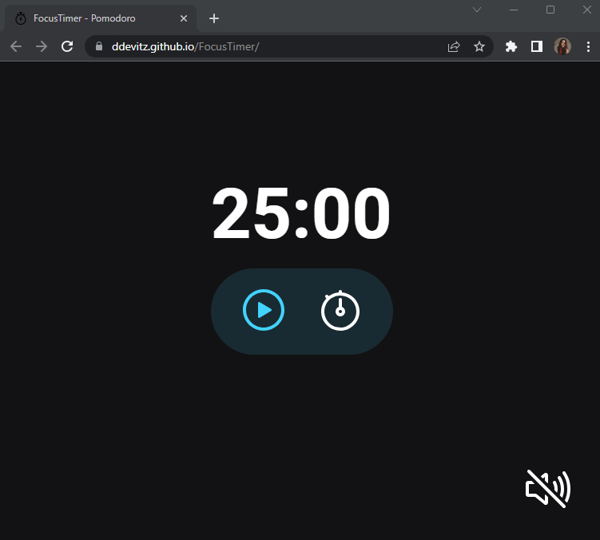

# FocusTimer

Criamos em aula um cronômetro para iniciarmos o módulo de Javascript. Com funções básicas e úteis.

## Funcionalidades

- Cronômetro
- Botão de Play
- Botão de Pause
- Botão de Stop
- Botão para adicionar minutos
- Botão com música ambiente

## Screenshots

